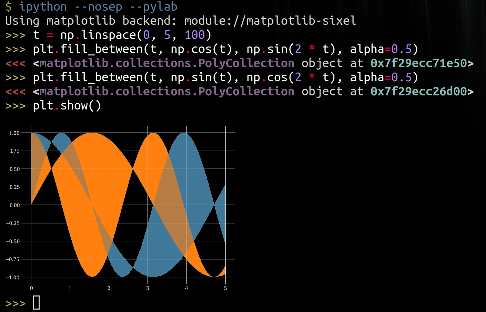

----

Changes from the upstream
-------------------------

This is customized for `WSLtty <https://github.com/mintty/wsltty>`_ (2022-02-07) which runs on WSL2 with SIXEL support.

* disabled transparency: it makes rendering better in WSLtty.
* 256 colors: originally 16 colors.
* added ``sixel.transparency`` and ``sixel.colors`` keys in ``plt.rcParams``.

As a result, you get

1. plot with white background by default,
2. plot with black background with ``plt.style.use('dark_background')``, and
3. plot as below with the customized `matplotlibrc <matplotlibrc>`_ installed in ``~/.config/matplotlib/``.

You can try this backend by

::

    $ python3 -m pip install .
    
----

Matplotlib-sixel backend
========================

A matplotlib backend which outputs sixel graphics onto the terminal.
The code is inspired by the ipython-notebook matplotlib backend.

Dependencies
------------

* terminal with Sixel support like `xterm <https://invisible-island.net/xterm/>`_, `iterm <https://iterm2.com/>`_ and `mlterm <https://github.com/arakiken/mlterm>`_.
* `imagemagick <https://imagemagick.org/>`_ for converting the graphics.
* `matplotlib <https://matplotlib.org/>`_.

Installation
-------------

::

    pip install matplotlib-sixel

Configuration
-------------

the backend has to be altered. Either in your python session with::

    import matplotlib
    matplotlib.use('module://sixel')

or in your ``matplotlibrc`` file::

    backend: module://sixel

To get the colors in the demo above, you can copy
`this matplotlibrc <./matplotlibrc>`_ and make it your own.
